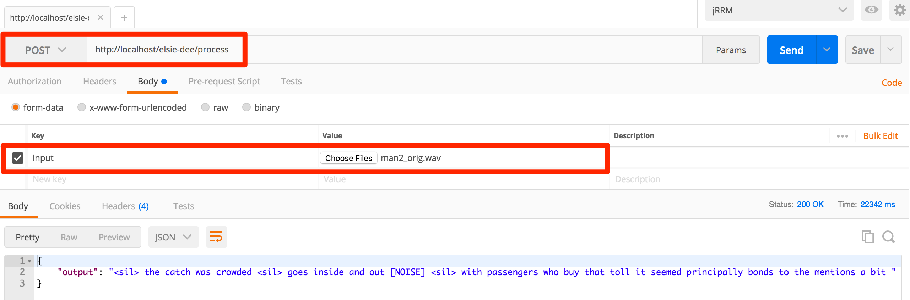

# Elsie-Dee

Elsie-Dee is a Spring application user as a wrapper for the Carnegie Mellon University famous Sphinx4 Speech-to-Text library.

* [Sphinx4](https://github.com/cmusphinx/sphinx4)

Although Elsie-Dee is currently under development, it can already be used to process small audio files, for speech-to-text, and do face classification.

# Technology Stack

Elsie-Dee is comprised of the following technology stack:

* Gradle
* Java 8
* Spring Boot
* Spring Web
* Spring Actuator
* Sphinx4

# Dependencies

* Configuration Service
  * This microservice depends on the Configuration Service in order to retrieve its settings. It means that before starting this server,
    please make sure that the one it depends on is already running.
  * You can find out how to run the Configuration Service here: [Configuration Service](https://github.com/ekholabs/configuration-service)
* Eureka Service
  * As a second note, this microservice also depends on the Eureka Service in order to register for service discovery. However,
    the Eureka Service does not need to be running before this one can be started.
  * You can find out how to run the Configuration Service here: [Eureka Service](https://github.com/ekholabs/eureka-service)
* Elsie-Deetect
  * This microservice is used to detect the language from a given speech. Elsie-Dee implements it as a Feign Client,
    hence the dependency.
  * You can find out how to run the Elsie-Deetect Service here: [Elsie Deetect](https://github.com/ekholabs/elsie-deetect)
* Elsie-Dee Sight
  * This microservice is used for face classification. Elsie-Dee implements it as a Feign Client,
    hence the dependency.
  * You can find out how to run the Elsie-Dee Sight Service here: [Elsie-Dee Sight](https://github.com/ekholabs/elsie-deesight)
* Elsie-Dee Audio rip
  * This microservice is used to extract audio from video files. Elsie-Dee implements it as a Feign Client,
    hence the dependency.
  * You can find out how to run the Elsie-Dee Audio Rip Service here: [Elsie-Dee Audio Rip](https://github.com/ekholabs/elsie-dee-audiorip)

In a dependency order priority, the Eureka Service should be started before everything else. The second in the list must be the Configuration Service.

# Pulling the Docker Image

* ```docker pull ekholabs/elsie-dee```

# Running the Docker Container

* ```docker run -d -p 80:80 --link configuration-service --link eureka-service --link elsie-deetect --link elsie-deesight --link elsie-dee-audiorip ekholabs/elsie-dee```

Elsie-Dee will run on the background. To check details about the container, execute the following:

* ```docker ps```

For logs:

* ```docker logs [container_id]```

# Actuator Endpoints

Once the application is running, the user/developer can find health status and metrics via the following endpoints:

* http://localhost/elsie-dee/health
* http://localhost/elsie-dee/metrics
* http://localhost/elsie-dee/env

# Processing Audio Files

In order to process audio files and extract text, one can use the ```/processAudio``` endpoint with Postman or cURL.

## Postman



## cURL

* ```curl -v -F input=@[path_to_file] http://localhost/elsie-dee/process```

You can find a test file here: [male speaking](https://github.com/ekholabs/elsie-dee/blob/master/src/test/resources/man2_orig.wav)
